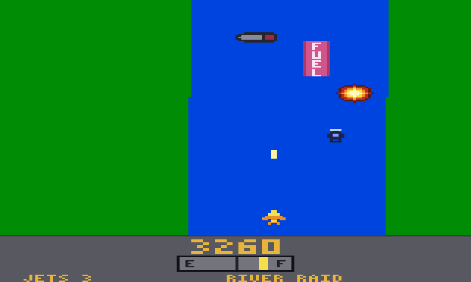

# River Raid

A browser tribute to the 1982 Atari 2600 classic, built with React and TypeScript, with a **global leaderboard**.



Fly upstream, shoot everything that moves, blow up the bridges and keep an eye on the fuel gauge. The river is the same on every run, so scores are comparable between pilots.

> Fan-made tribute. *River Raid* was created by Carol Shaw and published by Activision, which is not affiliated with and does not endorse this project. The code, sprites and sounds here are original: nothing was taken from the cartridge.

## How to play

| Key | Action |
| --- | --- |
| ← → (or A D) | Steer |
| ↑ (or W) | Fly faster |
| ↓ (or S) | Slow down |
| Space (or Z, X) | Fire. Hold it down for continuous fire; only one missile can be in flight |
| P or Esc | Pause (the game also pauses when the window loses focus) |
| M | Mute |

### Rules

- Crash into a river bank, an island, a bridge, an enemy or run out of fuel and you lose a jet. You start with **three spare jets** and earn another one every **10,000 points** (nine at most).
- Fly over a **fuel depot** to refuel: the slower you pass over it, the more you get. A siren sounds below a quarter of a tank. Shooting a depot scores, but denies you the fuel.
- Every section ends with a **bridge**. Shoot it to continue. After a crash you restart at the beginning of the current section, or at the beginning of the next one if you had already blown up the bridge.
- Light-green banks mean a plain river; dark-green banks add islands that split it in two.

| Target | Points |
| --- | --- |
| Tanker | 30 |
| Helicopter | 60 |
| Fuel depot | 80 |
| Jet | 100 |
| Bridge | 500 |

## Run it locally

Requires Node.js 24 and [pnpm](https://pnpm.io) (`nvm use` picks the right Node version).

```bash
pnpm install
pnpm dev
```

This starts the API on port 8787 and the web client on <http://localhost:5173>, which proxies `/api` to the API. Scores are stored in `data/leaderboard.sqlite`.

| Script | What it does |
| --- | --- |
| `pnpm dev` | API and web client with hot reload |
| `pnpm test` | Unit and component tests (Vitest) |
| `pnpm typecheck` | TypeScript, for the client, the server and the tooling |
| `pnpm lint` | ESLint, including the architecture boundaries between layers |
| `pnpm build` | Type-checks, bundles the client into `dist/` and compiles the server into `dist-server/` |
| `pnpm start` | Runs the built server, which also serves `dist/` |
| `pnpm moderate` | Lists and removes scores and plays the stored recordings again (see [Moderation](#moderation)) |
| `pnpm record-golden-runs` | Records the golden runs after the rules of the game were changed on purpose (see [How scores are protected](#how-scores-are-protected)) |

## The global leaderboard

The board is only *global* once the server runs somewhere everybody can reach. A single Node process serves both the game and the API, so any host that runs a Node 24 process (or a container) and keeps a persistent disk will do. Put it behind HTTPS.

```bash
pnpm build
PORT=8080 DATABASE_PATH=/var/lib/river-raid/leaderboard.sqlite pnpm start
```

| Variable | Default | Meaning |
| --- | --- | --- |
| `PORT` | `8787` | Port to listen on |
| `DATABASE_PATH` | `data/leaderboard.sqlite` | SQLite file; its folder is created if needed |
| `STATIC_DIR` | `dist` when it exists | Folder with the built web client; leave it out to serve the API only |
| `TRUST_PROXY` | `0` | How many reverse proxies stand in front of the server, each appending to `X-Forwarded-For`. At `0` the header is ignored; behind one platform proxy set `1`, or every player shares the proxy's rate limit |
| `LOG_CLIENT_ADDRESS` | `false` | Add the client address to the security log lines. Off by default: the log says what happened, not who did it |

With Docker, mount a volume on `/data`, otherwise every deploy starts with an empty board. The image runs as an unprivileged user and has a health check:

```bash
docker build -t river-raid .
docker run -p 8080:8080 -v river-raid-data:/data \
  --read-only --tmpfs /tmp --cap-drop ALL --security-opt no-new-privileges river-raid
```

These flags are the recommended hardening, and the CI builds the image and runs it with exactly them on a fresh volume. Run one instance per database: the rate limiter lives in memory and SQLite has a single writer.

### Deploying

Every push to `main` is verified by [GitHub Actions](.github/workflows/ci.yml), built as a multi-architecture image and, once switched on, deployed with the `zs` CLI to the [ZeroServer Community Cloud](https://zeroserver.cc) as a single instance, with its SQLite file on a persistent volume. [`docs/deploy.md`](docs/deploy.md) has the setup, the day-to-day commands and what to expect from one instance; [ADR 0004](docs/adr/0004-single-instance-on-zeroserver.md) says why it is not several.

### Link previews

The tags that make a shared link look good (Open Graph and the X card) are in [`index.html`](index.html), and the 1200×630 picture they point to is [`public/og-image.png`](public/og-image.png). Crawlers do not run scripts and only follow absolute URLs, so the address of the site is written out in three places there: the canonical link, `og:url` and `og:image`. Change all three when the site gets another address, and ask Facebook's Sharing Debugger or LinkedIn's Post Inspector to fetch the page again, since they keep the old preview.

The credits at the foot of the title screen use the icons in [`public/credits`](public/credits). They are copies on purpose: the content security policy only lets the page load images from its own origin.

### API

| Endpoint | Description |
| --- | --- |
| `POST /api/sessions` | Registers the start of a run. Returns `201 { sessionId }` |
| `POST /api/scores` | Body `{ sessionId, initials, score, engineVersion, replay }`, as JSON, at most 512 KiB. Returns `201 { entry }` with the rank |
| `GET /api/scores?limit=10` | The best scores, highest first (`limit` from 1 to 100) |
| `GET /api/health` | `200 { status: "ok", revision? }`, where `revision` is the commit the image was built from |

Errors come as `{ error: { code, message } }`. The wire format lives in [`shared/leaderboard-contract.ts`](shared/leaderboard-contract.ts).

| Status | Code | Meaning |
| --- | --- | --- |
| 400 | `invalid_request` | The body or a parameter is not what the API takes (an unknown route is a 404 with this code) |
| 404 | `unknown_session` | The session was never issued, expired or was removed |
| 409 | `session_already_used` | The session already holds a score |
| 409 | `outdated_client` | The page was loaded with other rules of the game: reload it |
| 409 | `duplicate_replay` | This game was already submitted |
| 413 | `payload_too_large` | The body is over the limit of the route |
| 415 | `unsupported_media_type` | The body was not sent as `application/json` |
| 422 | `invalid_replay` | The recording does not end in a game over exactly at its last tick |
| 422 | `score_mismatch` | Playing the recording gives another score than the one sent |
| 422 | `implausible_score` | The recording is longer than the session is old, or beats the points cap |
| 422 | `initials_not_allowed` | The initials are on the blocklist |
| 429 | `rate_limited` | Too many requests from this client; `Retry-After` says when to come back |
| 500 | `internal_error` | A fault of the server. Nothing about the cause is sent |

### How scores are protected

A game that runs in the player's browser can always be tampered with, so the server does not take the score on trust: it takes the **game**.

1. A run opens a **play session**; the server notes when it started.
2. The client writes down the controls held on every tick (about 2 KB for a two-minute game) and sends them with the score.
3. The server plays the recording again with the very same engine (`shared/game`), requires the game to end in a game over exactly at the last tick, and keeps the score of *its* simulation. A different score from the client is refused.
4. The recording cannot be longer than the session is old: a game cannot be made up faster than it can be played.
5. A session holds one score, and the same game cannot be posted twice, however its recording is dressed up. Initials are three characters, `A–Z` or `0–9`, checked against a short blocklist. Requests are rate limited per client network, sizes are capped and slow requests are dropped.
6. The rules are versioned (`ENGINE_VERSION`). Changing them without raising it makes the tests fail: four recorded runs and a digest of 60 sections of river must still come out the same. Pages that were open before a release are told to reload.

What it does **not** stop is a program that really plays the game, in real time, and sends the recordings of games it played well. No web game can tell that from a good player. The rate limit and the [moderation](#moderation) command are the answer to that. The reasoning is in [ADR 0003](docs/adr/0003-replay-verified-scores.md) and the review against the OWASP Top 10, the OWASP API Security Top 10 and the ASVS is in [`docs/security.md`](docs/security.md).

### Moderation

With shell access to the database (`DATABASE_PATH` selects it, as for the server):

```bash
pnpm moderate list --limit 20      # the best scores, with the ids that remove takes
pnpm moderate remove 12 15         # delete scores; their sessions go with them
pnpm moderate reverify             # play every stored recording again and list the ones that fail
pnpm moderate reverify --remove    # ... and delete them
```

In the built image: `docker exec <container> node dist-server/server/cli.js list`.

## How it is built

```
shared/
  game/            the game: river generation, objects, collisions, scoring (pure TypeScript, no DOM, no React);
                   the API runs the same code to re-play a run
  leaderboard-contract.ts   the wire format, used by both sides
src/               the web client
  application/     ports and the fixed-timestep game loop
  infrastructure/  adapters: canvas renderer, keyboard, Web Audio, HTTP client, localStorage
  ui/              React screens: title, game, game over, leaderboard
  compositionRoot.ts   wires the ports to their adapters
server/            the API
  domain/          session, score and storage rules
  application/     use cases and ports
  infrastructure/  SQLite and in-memory stores, Hono routes, rate limiting, the moderation command
docs/adr/          architecture decisions
```

- The game runs at a fixed 60 ticks per second on a 160×192 canvas that CSS scales up; the world is a pure function of the section number, so every run meets the same river.
- React only draws menus. The game loop lives outside React state, and its screen creates and tears it down safely under Strict Mode.
- ESLint forbids inner layers from importing outer ones.

The reasoning is written down in [`docs/adr`](docs/adr), and the security review in [`docs/security.md`](docs/security.md).
